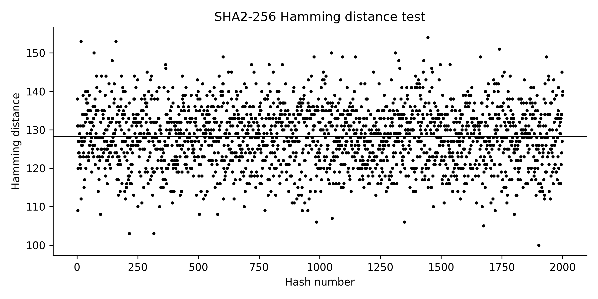
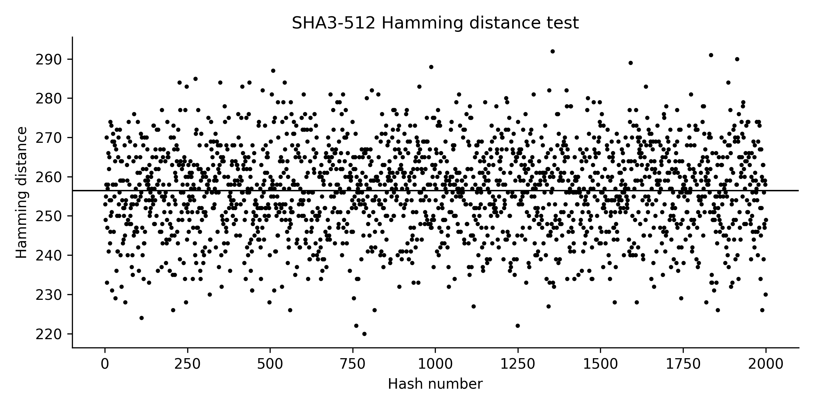
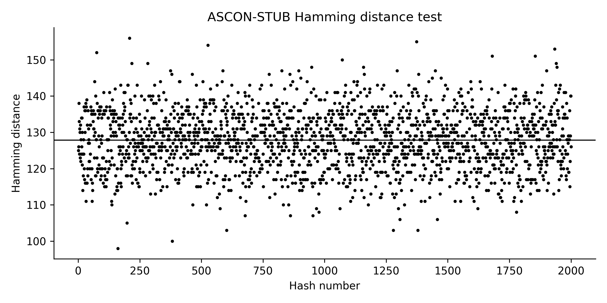
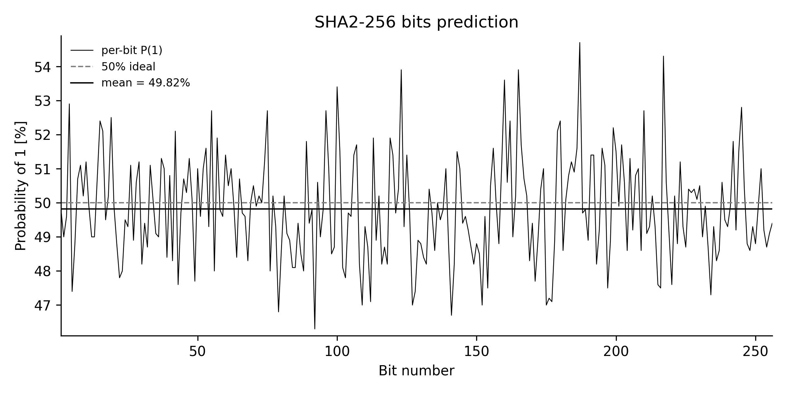
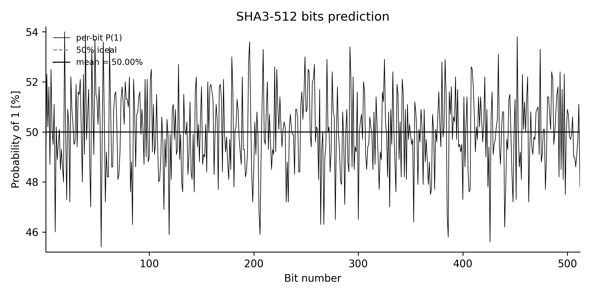
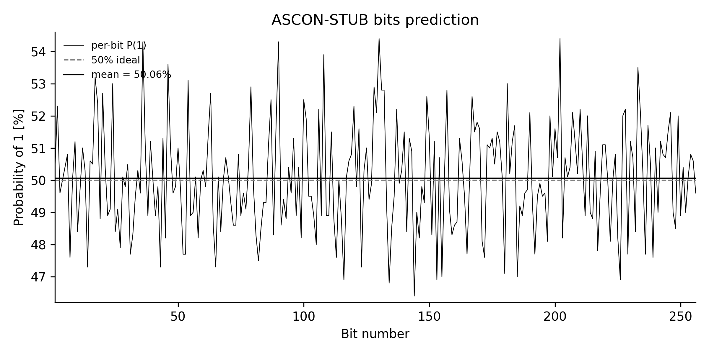

# Cryptographic Hash Statistical Analysis / Analiza statystyczna funkcji skrótu

This repository contains an empirical statistical analysis of cryptographic hash functions:

* **SHA2-256**
* **SHA3-512**
* **ASCON-STUB** (temporary placeholder using SHAKE256 256-bit output)

Repozytorium zawiera empiryczną analizę statystyczną następujących funkcji skrótu:

* **SHA2-256**
* **SHA3-512**
* **ASCON-STUB** (tymczasowy zamiennik oparty na SHAKE256 256-bit, nie jest to jeszcze prawdziwe ASCON-hash)

The goal is to evaluate:
Celem analizy jest ocena:

1. **Avalanche / diffusion**
   Jak bardzo zmienia się skrót po zmianie jednego bitu wejścia
   / How much the digest changes when a single input bit is flipped.

2. **Per-bit bias / predictability**
   Czy można przewidzieć wartość konkretnego bitu skrótu
   / Can any output bit be predicted better than random.

3. **Randomness of bit structure**
   Czy rozkład zer i jedynek wygląda losowo, bez długich podejrzanych sekwencji
   / Do 0/1 runs behave like random Bernoulli(0.5) output.

---

## 1. Methodology / Metodyka

All tests were implemented in Python (`hashlib`, `numpy`, `matplotlib`).
Wszystkie testy zostały zaimplementowane w Pythonie (`hashlib`, `numpy`, `matplotlib`).

Random 64-byte inputs were generated using `secrets.token_bytes`.
Losowe wiadomości wejściowe (64 bajty) generowano przy użyciu `secrets.token_bytes`.

### 1.1 Hamming Distance Test (Efekt lawiny)

**EN:**
For each sample:

1. Generate random message `m`.
2. Flip exactly one random bit → get `m'`.
3. Compute `hash(m)` and `hash(m')`.
4. Measure the Hamming distance between the two digests (number of differing bit positions).
5. Repeat 2000 times.

If the hash has good diffusion, flipping 1 bit in input should flip ~50% of output bits.
For an `n`-bit hash we expect ≈ `n / 2`.

**PL:**
Dla każdej próby:

1. Generujemy losową wiadomość `m`.
2. Odwracamy dokładnie jeden losowy bit → mamy `m'`.
3. Liczymy `hash(m)` i `hash(m')`.
4. Obliczamy odległość Hamminga między skrótami (liczbę różniących się bitów).
5. Powtarzamy 2000 razy.

Dobra funkcja skrótu ma silny efekt lawiny: zmiana jednego bitu wejścia powinna zmienić około połowę bitów w skrócie.
Dla skrótu o długości `n` bitów oczekujemy około `n / 2` zmienionych bitów.

---

### 1.2 Bit Prediction Test (Predykcja bitów / uprzedzenie pojedynczych bitów)

**EN:**
For each output bit position `i`:

* Hash 1000 random messages.
* Record how often bit `i` is `1`.
* Estimate `P(bit_i = 1)` in %.

We then compute:

* min, max, avg, and standard deviation of `P(1)` across all bit positions.

We also generate a plot:

* thin black line: empirical `P(1)` for each bit index,
* dashed grey line: ideal 50%,
* solid black line: measured mean value.

**PL:**
Dla każdej pozycji bitowej `i` w skrócie:

* Haszujemy 1000 losowych wiadomości.
* Sprawdzamy, jak często bit `i` ma wartość `1`.
* Szacujemy prawdopodobieństwo `P(bit_i = 1)` w %.

Następnie liczymy:

* minimum, maksimum, średnią i odchylenie standardowe wartości `P(1)` po wszystkich bitach.

Generujemy wykres:

* cienka czarna linia: empiryczne `P(1)` dla każdego bitu,
* szara linia przerywana: idealne 50%,
* czarna linia pozioma: zmierzona średnia.

Interpretacja: żaden bit nie powinien być systematycznie przesunięty np. do 60% jedynek.
To byłoby oznaką stronniczości / przewidywalności.

---

### 1.3 Runs Test (Test serii Walda–Wolfowitza)

**EN:**
Treat each hash output as a binary string.
We count runs (maximal blocks of equal bits like `000` or `1111`).
For each digest we compute:

* observed number of runs `R`,
* expected number of runs `R̄`,
* standard deviation `SD`,
* test statistic
  [
  Z = \frac{R - \overline{R}}{SD}
  ]

We repeat for 1000 hashes and report the mean of `|Z|`.

If the output bits behave like i.i.d. coin flips with probability 0.5, then `Z` should be near 0.
Values with |Z| > ~1.96 would indicate statistically significant deviation from randomness at the 5% level.

**PL:**
Traktujemy skrót jako ciąg zer i jedynek.
Liczymy liczbę serii `R` (seria = maksymalnie długi ciąg jednakowych bitów, np. `0000` albo `111`).
Dla każdego skrótu obliczamy:

* liczbę serii `R`,
* wartość oczekiwaną liczby serii `R̄`,
* odchylenie standardowe `SD`,
* statystykę testową
  [
  Z = \frac{R - \overline{R}}{SD}
  ]

Powtarzamy to dla 1000 skrótów i bierzemy średnią wartość `|Z|`.

Jeżeli bity wyglądają losowo, `|Z|` powinno być blisko zera.
Wartości `|Z|` powyżej ok. `1.96` sugerowałyby odejście od losowości przy poziomie istotności 5%.

---

## 2. Results / Wyniki

Wszystkie wyniki pochodzą z uruchomienia skryptu `Implementation.py`.

### 2.1 Hamming Distance (Avalanche Effect / Efekt lawiny)

**SHA2-256**

* Average Hamming distance / średnia odległość Hamminga: **128.16 bitów**
* Expected / oczekiwane: **128 bitów** (256 / 2)

**SHA3-512**

* Average Hamming distance / średnia: **256.47 bitów**
* Expected / oczekiwane: **256 bitów** (512 / 2)

**ASCON-STUB**

* Average Hamming distance / średnia: **127.81 bitów**
* Expected / oczekiwane: **128 bitów** (256 / 2)

**Interpretation (EN):**
Flipping just one bit in the input changes ~half of the output bits for all tested functions.
This confirms a strong avalanche effect and shows good diffusion.

**Interpretacja (PL):**
Zmiana pojedynczego bitu wejścia powoduje zmianę ~połowy bitów w skrócie.
To oznacza silny efekt lawiny i dobrą dyfuzję, czyli cechę oczekiwaną od bezpiecznej funkcji skrótu.

#### Plots / Wykresy (Hamming distance scatter)





Na wykresach:

* kropki = odległość Hamminga dla pojedynczej próby,
* linia pozioma = średnia z próby.
  Brak trendu wzdłuż osi X sugeruje brak strukturalnych zależności.

---

### 2.2 Bit Prediction (Predykcja bitów)

For each hash, across all bit positions we measured min / max / avg / sd of `P(bit = 1)`:

Dla każdej funkcji skrótu zmierzyliśmy minimalne, maksymalne, średnie i odchylenie standardowe prawdopodobieństwa wystąpienia jedynki w danym bicie (`P(bit = 1)`):

**SHA2-256**

* Min: **46.30%**
* Max: **54.70%**
* Avg (średnia): **49.82%**
* SD (odch. std): **±1.53**

**SHA3-512**

* Min: **45.40%**
* Max: **54.00%**
* Avg: **50.00%**
* SD: **±1.60**

**ASCON-STUB**

* Min: **46.40%**
* Max: **54.40%**
* Avg: **50.06%**
* SD: **±1.65**

**Interpretation (EN):**

* The average probability is ~50% for all functions ⇒ no global bias.
* Individual bits fluctuate between ~46% and ~55%.
  This is normal with only 1000 samples per bit: statistically, even a perfect fair coin will not hit exactly 50% in a small sample.
* No bit shows a stable extreme bias (e.g. 60% ones).
  Therefore, no single bit is trivially predictable.

**Interpretacja (PL):**

* Średnia dla wszystkich bitów to ~50%, więc funkcje nie faworyzują ani `0`, ani `1`.
* Poszczególne bity wahają się około 46–55%.
  To jest typowe przy próbie rzędu 1000 – nawet idealnie losowy bit nie będzie miał dokładnie 50.00%.
* Nie obserwujemy bitu, który byłby skrajnie uprzywilejowany (np. stale ~60% jedynek), więc nie ma łatwego do przewidzenia bitu.

#### Plots / Wykresy (Probability of 1 per bit)





Opis wykresu:

* cienka czarna linia: prawdopodobieństwo `P(1)` dla każdego bitu,
* szara linia przerywana: idealne 50%,
* czarna linia pozioma: średnia zmierzona wartość (np. `mean = 49.82%` dla SHA2-256),
* legenda pokazuje średnią liczbowo.

Brak trendu (np. „pierwsze 32 bity odstają”) sugeruje brak strukturalnego biasu w konkretnych rejonach skrótu.

---

### 2.3 Runs Test (Test serii)

Mean absolute `|Z|` from Wald–Wolfowitz runs test:

Średnie `|Z|` z testu serii Walda–Wolfowitza:

* **SHA2-256:** mean |Z| = **0.789**
* **SHA3-512:** mean |Z| = **0.830**
* **ASCON-STUB:** mean |Z| = **0.808**

**Interpretation (EN):**
For a random-looking binary sequence, `Z` should be close to 0.
A classical rejection threshold is |Z| > 1.96 at 5% significance.
All observed |Z| values are well below 1.96, which means the sequences of 0s and 1s in the outputs do not show abnormal streaks or over-alternation.

**Interpretacja (PL):**
Dla losowego ciągu zer i jedynek statystyka `Z` powinna być bliska 0.
Klasyczny próg istotności to |Z| > 1.96.
Nasze wartości są znacznie niższe, więc kolejność bitów w skrócie (długości serii zer/jedynek) nie odbiega w istotny sposób od zachowania losowego.

---

## 3. Security Discussion / Wnioski bezpieczeństwa

**EN:**

* The Hamming distance test confirms strong diffusion (avalanche effect): flipping one input bit flips about half of the output bits.
* The bit prediction test shows that no output bit position is trivially biased or predictable.
* The runs test shows that the pattern of 0/1 in the digest is statistically consistent with randomness.
* SHA2-256 and SHA3-512 therefore behave as expected from secure modern hash functions.
* The ASCON-STUB results only demonstrate that the testing pipeline works; they are NOT yet the true ASCON-hash results.

**PL:**

* Test odległości Hamminga potwierdza silny efekt lawiny: zmiana jednego bitu wejściowego powoduje zmianę ~połowy bitów wyniku.
* Test predykcji bitów pokazuje, że żaden pojedynczy bit nie ma istotnego, stałego odchylenia od 50%, więc nie da się łatwo przewidzieć konkretnego bitu skrótu.
* Test serii wskazuje, że rozkład zer i jedynek wygląda jak losowy – wartości statystyki |Z| są bliskie 0 i znacznie poniżej progu odrzucenia hipotezy o losowości.
* SHA2-256 i SHA3-512 zachowują się zgodnie z oczekiwaniami wobec bezpiecznych funkcji skrótu.
* Wyniki dla ASCON-STUB mają charakter techniczny (użyto SHAKE256 jako substytutu), więc nie mogą być traktowane jako finalna ocena kryptograficzna prawdziwego ASCON-hash.

---

## 4. Reproducibility / Reprodukcja wyników

**EN / PL:**

1. Install dependencies / Zainstaluj zależności:

   ```bash
   pip install numpy matplotlib
   ```

2. Run the experiment / Uruchom eksperyment:

   ```bash
   python Implementation.py
   ```

3. The script will:

   * print summary statistics (Hamming averages, bit prediction stats, runs test |Z|),
   * generate plots in PNG (300 DPI):

     * `hamming_SHA2-256.png`
     * `hamming_SHA3-512.png`
     * `hamming_ASCON-STUB.png`
     * `bit_prediction_SHA2-256.png`
     * `bit_prediction_SHA3-512.png`
     * `bit_prediction_ASCON-STUB.png`

These figures can be directly inserted into documentation or a lab report.
Te obrazy można bezpośrednio wkleić do sprawozdania / rozdziału eksperymentalnego.

---

## 5. Files in the repository / Pliki w repozytorium

* `Implementation.py`
  Python script implementing:

  * Hamming Distance Test
  * Bit Prediction Test
  * Runs Test
  * plot generation

* `hamming_*.png`
  Scatter plots for the avalanche effect.

* `bit_prediction_*.png`
  Per-bit bias / predictability plots.

* `README.md`
  This document (methodology, results, interpretation in English and Polish).

---

### TL;DR

**EN:**
SHA2-256 and SHA3-512 behave like secure cryptographic hash functions:

* strong avalanche effect,
* no predictable output bit,
* random-looking bit structure.

**PL:**
SHA2-256 i SHA3-512 zachowują się jak bezpieczne funkcje skrótu:

* silny efekt lawiny,
* brak przewidywalnych bitów wyjściowych,
* brak nielosowych wzorców w ciągu zer i jedynek.

`ASCON-STUB` wymaga podmiany na prawdziwą implementację ASCON-hash, aby móc wyciągać pełne wnioski kryptograficzne.
